# 🚀 Bitcoin Sprint CI/CD Strategy & Implementation Guide
# Enterprise-Grade CI/CD Pipeline for Blockchain Infrastructure

## 📋 Executive Summary

This CI/CD strategy transforms Bitcoin Sprint from a development project into a production-ready, enterprise-grade blockchain platform with automated testing, security scanning, performance monitoring, and multi-environment deployments.

## 🎯 Strategic Objectives

### 1. **Quality Assurance**
- Automated testing across multiple platforms (Linux, Windows, macOS)
- Security vulnerability scanning and compliance checks
- Code quality analysis and static analysis
- Performance regression detection

### 2. **Developer Experience**
- Fast feedback loops with parallel job execution
- Automated dependency management and caching
- Comprehensive test reporting and coverage
- Easy deployment to multiple environments

### 3. **Operational Excellence**
- Automated security scanning and compliance
- Performance monitoring and benchmarking
- Multi-environment deployment automation
- Infrastructure as Code (IaC) validation

### 4. **Business Value**
- Reduced time-to-market for new features
- Improved code quality and security posture
- Automated compliance and audit trails
- Cost optimization through efficient resource usage

## 🏗️ CI/CD Pipeline Architecture

### Phase 1: Code Quality & Security

### Phase 2: Testing & Validation

```mermaid
graph TD
    A[Code Quality ✅] --> B[Unit Tests]
    B --> C[Integration Tests]
    C --> D[Performance Tests]
    D --> E[Load Tests]
    E --> F[Docker Build]
```

### Phase 3: Deployment & Monitoring

```mermaid
graph TD
    A[Tests ✅] --> B[Build Docker Image]
    B --> C[Security Scan Image]
    C --> D[Push to Registry]
    D --> E[Deploy to Staging]
    E --> F[Integration Tests]
    F --> G[Deploy to Production]
    G --> H[Monitor Performance]
```

## 📊 Pipeline Metrics & KPIs

### Quality Metrics
- **Test Coverage**: Target > 80%
- **Security Vulnerabilities**: Target 0 critical/high
- **Code Quality Score**: Target A grade
- **Performance Regression**: < 5% degradation

### Speed Metrics
- **Build Time**: < 10 minutes
- **Test Execution**: < 15 minutes
- **Deployment Time**: < 5 minutes
- **Feedback Loop**: < 30 minutes

### Reliability Metrics
- **Pipeline Success Rate**: Target > 95%
- **Deployment Success Rate**: Target > 99%
- **Rollback Success Rate**: Target > 99%
- **MTTR (Mean Time to Recovery)**: < 15 minutes

## 🛠️ Implementation Roadmap

### Week 1-2: Foundation Setup
- [ ] Set up GitHub Actions workflows
- [ ] Configure Docker registry (GHCR)
- [ ] Set up monitoring and alerting
- [ ] Configure secrets management

### Week 3-4: Core Pipeline
- [ ] Implement automated testing
- [ ] Set up security scanning
- [ ] Configure performance monitoring
- [ ] Enable multi-environment deployments

### Week 5-6: Advanced Features
- [ ] Implement chaos engineering
- [ ] Set up canary deployments
- [ ] Configure auto-scaling
- [ ] Enable feature flags

### Week 7-8: Optimization & Monitoring
- [ ] Performance optimization
- [ ] Cost optimization
- [ ] Comprehensive monitoring
- [ ] Documentation and training

## 🔧 Workflow Breakdown

### 1. Complete CI/CD Pipeline (`complete-cicd.yml`)
**Purpose**: End-to-end pipeline from code to production
**Triggers**: Push, PR, manual, scheduled
**Jobs**:
- Code quality and security scanning
- Multi-platform testing (Ubuntu, Windows)
- Docker build and security scan
- Performance benchmarking
- Multi-environment deployment
- Release management

### 2. Security & Compliance (`security.yml`)
**Purpose**: Continuous security monitoring
**Triggers**: Push, PR, daily schedule
**Features**:
- Vulnerability scanning (Trivy, Snyk)
- License compliance checking
- Container image security
- Dependency review

### 3. Performance Monitoring (`performance.yml`)
**Purpose**: Performance regression detection
**Triggers**: Push, PR, weekly schedule
**Features**:
- Automated benchmarking
- Load testing
- Memory profiling
- Performance trend analysis

### 4. Deployment Pipeline (`deploy.yml`)
**Purpose**: Multi-environment deployment
**Triggers**: Manual trigger
**Features**:
- Environment-specific configurations
- Rollback capabilities
- Health checks and verification
- Slack notifications

## 🔒 Security & Compliance

### Security Scanning
- **SAST**: Static Application Security Testing
- **DAST**: Dynamic Application Security Testing
- **SCA**: Software Composition Analysis
- **Container Scanning**: Image vulnerability scanning
- **Secrets Detection**: Credential exposure prevention

### Compliance Frameworks
- **OWASP Top 10**: Web application security
- **CIS Benchmarks**: Infrastructure security
- **NIST Cybersecurity Framework**: Risk management
- **GDPR**: Data protection compliance
- **SOX**: Financial reporting compliance

## 📈 Performance Optimization

### Build Optimization
- **Layer Caching**: Docker layer optimization
- **Dependency Caching**: Go modules and Rust crates
- **Parallel Execution**: Concurrent job processing
- **Incremental Builds**: Only build changed components

### Test Optimization
- **Test Parallelization**: Run tests in parallel
- **Test Selection**: Run only affected tests
- **Flaky Test Detection**: Identify and fix unreliable tests
- **Performance Baselines**: Track and alert on regressions

## 🌐 Multi-Environment Strategy

### Development Environment
- **Purpose**: Feature development and testing
- **Resources**: Minimal, cost-effective
- **Data**: Mock/test data
- **Access**: Development team only

### Staging Environment
- **Purpose**: Pre-production validation
- **Resources**: Production-like sizing
- **Data**: Production-like data (anonymized)
- **Access**: QA and development teams

### Production Environment
- **Purpose**: Live customer traffic
- **Resources**: Auto-scaling, high availability
- **Data**: Real customer data
- **Access**: Restricted, monitored

## 📊 Monitoring & Observability

### Application Metrics
- **Response Times**: API latency monitoring
- **Error Rates**: Exception tracking
- **Throughput**: Requests per second
- **Resource Usage**: CPU, memory, disk

### Infrastructure Metrics
- **Container Health**: Docker container monitoring
- **Network Performance**: Latency and bandwidth
- **Database Performance**: Query performance
- **External Dependencies**: Third-party service monitoring

### Business Metrics
- **User Adoption**: Feature usage tracking
- **Performance Impact**: Business KPI correlation
- **Cost Analysis**: Resource usage optimization
- **Security Incidents**: Threat detection and response

## 🚀 Deployment Strategies

### Blue-Green Deployment
- **Zero Downtime**: Switch between environments
- **Instant Rollback**: Switch back if issues detected
- **Gradual Traffic**: Slowly route traffic to new version
- **Automated Testing**: Validate before full switch

### Canary Deployment
- **Risk Mitigation**: Deploy to subset of users
- **Gradual Rollout**: Increase traffic percentage
- **Automated Monitoring**: Performance and error tracking
- **Quick Rollback**: Revert if thresholds exceeded

### Feature Flags
- **Trunk-Based Development**: Enable/disable features
- **A/B Testing**: Compare feature performance
- **Gradual Rollout**: Control feature exposure
- **Emergency Kill Switch**: Disable problematic features

## 💰 Cost Optimization

### Infrastructure Costs
- **Spot Instances**: Use for non-critical workloads
- **Auto-Scaling**: Scale based on demand
- **Resource Optimization**: Right-size containers
- **Caching**: Reduce compute requirements

### Development Costs
- **Parallel Pipelines**: Reduce wait times
- **Test Optimization**: Faster feedback loops
- **Automated Testing**: Reduce manual testing
- **Self-Service**: Developer self-sufficiency

## 📚 Documentation & Training

### Developer Documentation
- **Pipeline Usage**: How to use CI/CD pipelines
- **Best Practices**: Development guidelines
- **Troubleshooting**: Common issues and solutions
- **Contributing**: How to contribute to the platform

### Operational Documentation
- **Runbooks**: Incident response procedures
- **Monitoring**: Alert configuration and response
- **Deployment**: Environment-specific procedures
- **Security**: Security incident response

## 🎯 Success Criteria

### Technical Success
- [ ] Pipeline execution time < 30 minutes
- [ ] Test coverage > 80%
- [ ] Zero critical security vulnerabilities
- [ ] 99.9% deployment success rate
- [ ] < 15 minute MTTR

### Business Success
- [ ] 50% reduction in release cycle time
- [ ] 75% reduction in production incidents
- [ ] 90% developer satisfaction with CI/CD
- [ ] Positive ROI within 6 months
- [ ] Industry recognition for DevOps practices

## 🔄 Continuous Improvement

### Regular Reviews
- **Monthly**: Pipeline performance review
- **Quarterly**: Technology stack evaluation
- **Annually**: Comprehensive audit and planning

### Innovation Opportunities
- **AI/ML Integration**: Predictive performance analysis
- **Serverless Options**: Evaluate Lambda/container options
- **Edge Computing**: Global deployment optimization
- **Zero-Trust Security**: Enhanced security posture

---

## 📞 Getting Started

1. **Review Current Setup**: Analyze existing workflows
2. **Define Requirements**: Work with stakeholders on needs
3. **Pilot Implementation**: Start with core pipeline
4. **Iterate and Improve**: Continuous refinement
5. **Scale and Optimize**: Enterprise-wide rollout

**Contact**: Development Team Lead
**Timeline**: 8 weeks to production-ready CI/CD
**Budget**: $50K-$100K (infrastructure and tooling)
**ROI**: Expected 300% return on investment within 12 months
